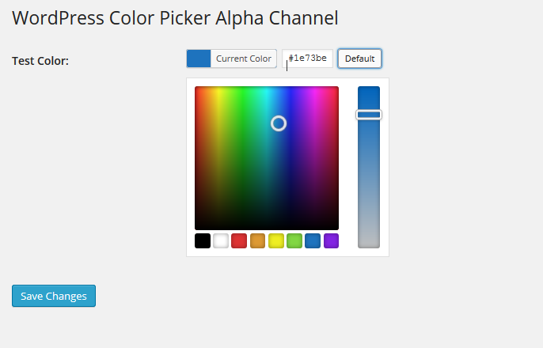
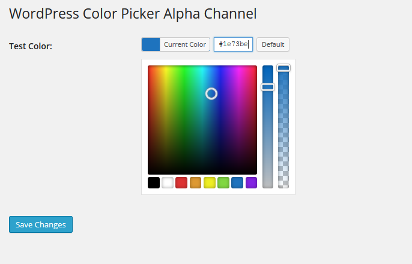
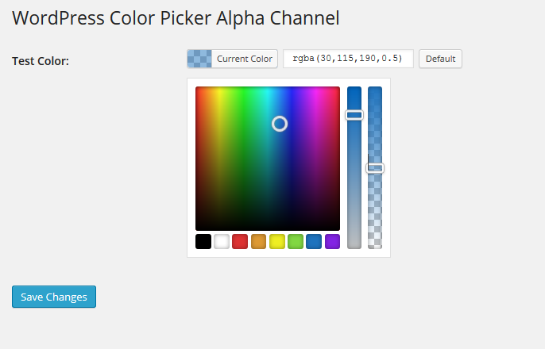

# WordPress Color Picker Alpha

* Overwrite [Automattic Iris][1] for enabled Alpha Channel in wpColorPicker
* Overwrite [WordPress Color Picker][4] for better implementation of overwriting the Iris

## Usage

1. **Download and Copy Script**: Download the script and copy it into the `js` folder of your theme options or plugin.

2. **Enqueue Styles and Scripts**: Add the following code to enqueue the necessary styles and scripts in your theme or plugin:

    ```php
    // Enqueue the default WordPress color picker style
    wp_enqueue_style( 'wp-color-picker' );

    /**
     * URL to the minified wp-color-picker-alpha script.
     *
     * Example for use in a theme:
     * `$url_to_script = get_template_directory_uri() . '/assets/js/wp-color-picker-alpha.min.js';`
     * Example for use in a plugin:
     * `$url_to_script = plugin_dir_url( __FILE__ ) . 'assets/js/wp-color-picker-alpha.min.js';`
     *
     * @var string $url_to_script
     */
    $url_to_script = '';

    /**
     * Whether to load the script in the footer.
     *
     * @link https://developer.wordpress.org/reference/functions/wp_register_script/#usage
     *
     * @since 6.8.0
     *
     * @var array|bool $args
     */
    $args = array(
      'strategy'  => 'defer',
      'in_footer' => true,
    );

    /**
     * Register the wp-color-picker-alpha script
     *
     * @link https://developer.wordpress.org/reference/functions/wp_register_script/
     */
    wp_register_script( 'wp-color-picker-alpha', $url_to_script, array( 'jquery', 'wp-color-picker' ), '3.0.4', $args );

    // Add inline script to initialize the color picker
    wp_add_inline_script(
        'wp-color-picker-alpha',
        'jQuery( function() { jQuery( ".color-picker" ).wpColorPicker(); } );'
    );

    // Enqueue the wp-color-picker-alpha script
    wp_enqueue_script( 'wp-color-picker-alpha' );
    ```

3. **Add Class and Data Attribute**: Add the class `.color-picker` and the attribute `data-alpha-enabled="true"` to your input elements. For example:

    ```html
    <input type="text" class="color-picker" data-alpha-enabled="true" />
    ```

> [!IMPORTANT]
> Only run in input and is defined data alpha in true.
>
> In versions prior to 3.0.0, this script started automatically. This behavior has been changed and it no longer starts automatically.

> [!CAUTION]
> This is a sample of how it should be included and should be adjusted as needed.

> [!TIP]
> Remove unnecessary comments once the functionality is understood.

### Optional Attributes

You can use the following optional attributes to customize the behavior of the color picker:

| Attribute                     | Description                                                                                                                                                 | Default |
| ----------------------------- | ----------------------------------------------------------------------------------------------------------------------------------------------------------- | ------- |
| `data-alpha-reset`            | Disables transparency after selecting a color from the palette.                                                                                             | `false` |
| `data-alpha-custom-width`     | Changes the default input width. Specify the desired width in pixels. To disable it, set the value to `false` or `0`.                                       | `130`   |
| `data-alpha-color-type`       | Sets the color format. Supports hex, rgb, hsl. This script converts to the corresponding type and the alpha channel is set. Use octohex to return RRGGBBAA. | `hex`   |
| `data-alpha-skip-debounce`    | Skips the debounce when setting the color inside the input. Set to true to skip the debounce.                                                               | `false` |
| `data-alpha-debounce-timeout` | Changes the default debounce timeout in milliseconds.                                                                                                       | `100`   |

> [!TIP]
> You can check or see an example of how to implement it in this repository [wp-color-picker-alpha-plugin](https://github.com/kallookoo/wp-color-picker-alpha-plugin).
> If you want to try it install it like any other plugin that is not in the WordPress repository.

## Screenshots

<details>
<summary>Images</summary>

### wpColorPicker



### wpColorPicker in mode Alpha Channel





</details>

## Changelog

See [CHANGELOG](CHANGELOG.md) for more information.

## Contributions and Support

If you would like to contribute please fork the project and [report bugs][2] or submit [pull requests][3].

> [!IMPORTANT]
> Read the [CONTRIBUTING.md](/CONTRIBUTING.md) beforehand.

[1]: https://github.com/Automattic/Iris
[2]: https://github.com/kallookoo/wp-color-picker-alpha/issues
[3]: https://github.com/kallookoo/wp-color-picker-alpha/pulls
[4]: https://github.com/WordPress/WordPress/blob/master/wp-admin/js/color-picker.js
